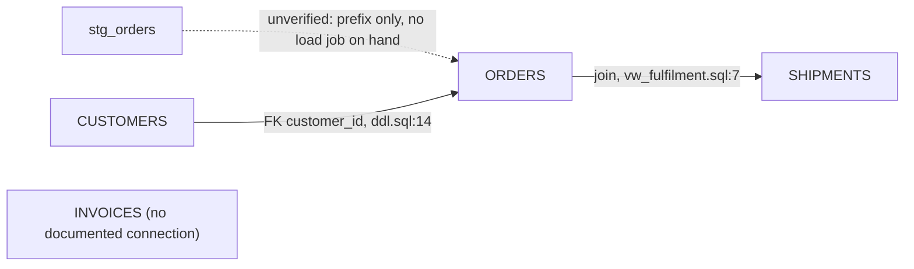

# Estate engine — map-my-estate

Load when grading edges and drawing (loop steps 3–4).

## What counts as edge evidence (and what never does)

| Evidence | Counts? | Cite as |
|---|---|---|
| FK / constraint in DDL on hand | ✔ evidenced | `file:line` |
| A join in provided code (view/proc/dbt model) | ✔ evidenced | `file:line` |
| Documented lineage (`landscape.md`, a runbook, a dbt manifest) | ✔ evidenced | file + entry |
| An attributed owner statement ("billing feeds the mart nightly — D. Chen, 06-04") | ✔ evidenced (attributed) | timeline/`by:` |
| Column-name similarity (`order_ref` → ORDERS) | ✘ never | dashed `[unverified]` + the confirming question |
| Prefix/suffix convention (`stg_`, `_raw`, `dim_`) | ✘ never | dashed `[unverified]` |
| "It would make sense" / model-world knowledge | ✘ never | dashed or absent, gap named |
| A `model-contract.md` design with no build evidence | ✘ as as-is | render "designed, build unconfirmed" |

## Mermaid conventions

- **ER:** `erDiagram` — `CUSTOMERS ||--o{ ORDERS : "customer_id (FK, ddl.sql:14)"` for
  evidenced; for unverified use a lineage-style dashed note or suffix the label
  `[unverified]` (erDiagram has no dashed edges — the label carries the status, and the
  ledger is authoritative).
- **Lineage:** `flowchart LR` — evidenced `A --> B`; unverified `A -.->|unverified| B`;
  islands as standalone nodes labeled `X["X (no documented connection)"]`.
- **Budget:** ~25 nodes/view. Bigger scope → multiple views (one per spine/mart), each
  with its own derived-from header and ledger.
- Every view's first line of surrounding text states the scope and the dashed count:
  *"NRR spine — 11 nodes, 9 evidenced edges, 3 unverified, 1 island."*

## The worked example (the bait refused)

The record holds: `ddl.sql` (ORDERS with `customer_id` FK → CUSTOMERS), `vw_fulfilment.sql`
(joins ORDERS to SHIPMENTS on `order_id`), and `landscape.md` listing INVOICES ("billing
system, owner unknown") plus `stg_orders` ("loader target, source unconfirmed").

| Edge | Kind | Evidence | Status |
|---|---|---|---|
| CUSTOMERS → ORDERS | FK | ddl.sql:14 | evidenced |
| ORDERS → SHIPMENTS | join | vw_fulfilment.sql:7 | evidenced |
| stg_orders → ORDERS | feed | none — prefix convention only | **[unverified]** — ask: which job loads ORDERS? |
| INVOICES → ? | — | none | island — ask the owner what reads/writes it |

The two questions on the right are the map's yield: answered, they harden the record;
drawn as solid arrows, they would have been lies with good posture.
